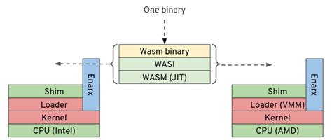

# Enarx Electronic Voting Protection

**Example case:**

We explore technological experiments with Enarx. Showcase is Remote Electronic Voting (REV). Ideally, electronic voting should provide these properties and many more:

1. Ballot Privacy: No outside observer can determine the contents of a specific vote.
2. Censorship-Resistance: No party, even the administrator of an election, can censor a valid vote.
3. Non-Repudiation: No party can modify or erase a vote that has been cast.
4. Correct Execution: No party can forge a false tally of votes.

**Problem:**

The system administrator observers the votes and modifies them during the election.

**Solution:**

Enarx Keep prevents the system administrator to observe and interfere with the election software. Keep workload is inside Trusted Execution Environments (TEEs) which provides a hardware-based solution to maintain data confidentiality and integrity, regardless of who might own or have access to the host system on which the application is running.

## Attack: Manipulation attack when election software is executed normally

Election software (vote 1 or 2, 9 votes):

```sh
# cargo run --release
$ bash run_elections.sh normal
Enter a vote: 1 or 2.
2
Vote 1=2
Vote 2=1
Vote 3=2
Vote 4=1
Vote 5=2
```

Election manipulation:

```sh
$ sudo bash stealvotes.sh voting-machine
Change the vote 1
Vote 1=2 --> Vote 1=1
Change the vote 3
Vote 3=2 --> Vote 3=1
Change the vote 5
Vote 5=2 --> Vote 5=1
```

## Attack: Run Enarx Keep without CPU hardware protection and search voting status

Election software (vote 1 or 2, 9 votes):

```sh
# enarx run --backend=kvm target/wasm32-wasi/release/voting-machine.wasm
$ bash run_elections.sh kvm
```

Search votes:

```sh
$ sudo bash vote_search.sh voting-machine
Vote 1=1
Vote 2=2
Vote 3=1
...
```

## Protected from the attacks: Run election software inside Enarx Keep with CPU hardware protection

Election software (vote 1 or 2, 9 votes):

```sh
# enarx run --backend=sev target/wasm32-wasi/release/voting-machine.wasm
$ bash run_elections.sh sev
or
# enarx run --backend=sgx target/wasm32-wasi/release/voting-machine.wasm
$ bash run_elections.sh sgx
```

Search votes:

```sh
$ sudo bash vote_search.sh voting-machine
```

## Confidential Computing

Isolate your data and code from the host and the hypervisor. You do not need to trust the host computer: assume compromised host, compromised owner of the host, compromised cloud platform.

Solution is to use the processor as the gatekeeper for the workload. Trusted Execution Environments (TEEs) is part of the main CPU which protects the workload from outsiders. This is especially suitable for micro services, to protect algorithms and data protection.

Utilizing TEE is laborious. Each CPU (AMD, Intel, IBM, ARM, etc.) are providing different environment to execute code inside the CPU. Writing a program for this requires using CPU specific low-level code and programming language is often limited to C (or Rust).

## Enarx Keep

This Confidential Computing demonstration uses [Enarx](https://enarx.dev/) to execute the workload inside protected Keep.

Enarx tries to make it as easy as possible to deploy code inside TEE (Enarx 0.2.0 supports Intel SGX process based Keep and AMD SEV VM-based Keep. A software developer writes the app without any extra knowledge about the CPU and TEE. Then Enarx creates one binary which can be executed inside a Keep which utilizes the CPU's TEE.

[Enarx version 0.2.0](https://blog.enarx.dev/balmoral-castle-enarx-0-2-0/):

- Development using KVM without hardware support
- Two TEEs supported AMD SEV and Intel SGX
- wasmtime 0.34.0 with networking enabled
- WASI networking with pre-opened sockets
- GDB debugging
- SEV-SNP attestation
- Revamped pure WASI integration tests added
- Download VCEK certificates for SEV platform and print to stdout in PEM format
- Uses Rust nightly builds

Limitations:

- Incomplete WASI support
- All IO is unencrypted
- No validation of attestation
- No attestation support for SGX


